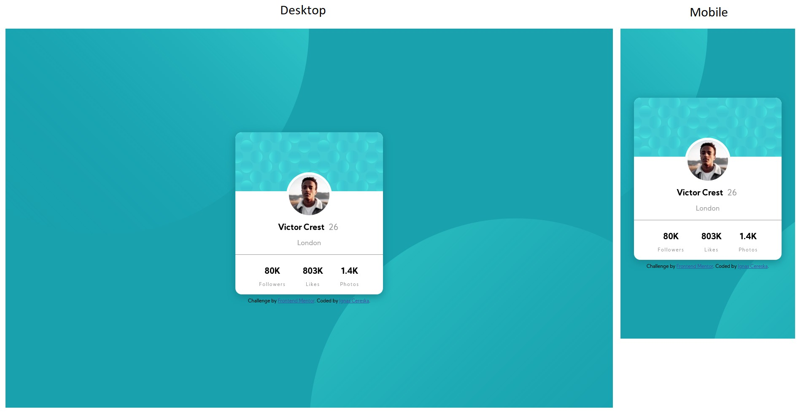

# Frontend Mentor - Profile card component solution

This is a solution to the [Profile card component challenge on Frontend Mentor](https://www.frontendmentor.io/challenges/profile-card-component-cfArpWshJ). Frontend Mentor challenges help you improve your coding skills by building realistic projects. 

## Table of contents

- [Overview](#overview)
  - [The challenge](#the-challenge)
  - [Screenshot](#screenshot)
- [My process](#my-process)
  - [Built with](#built-with)
  - [What I learned](#what-i-learned)
  - [Continued development](#continued-development)
  - [Useful resources](#useful-resources)
- [Author](#author)

## Overview

### The challenge

Users should be able to:

- View the optimal layout depending on their device's screen size
- See hover states for interactive elements

### Screenshot



## My process

### Built with

- HTML5 and CSS
- Flex box
- Visual Studio Code software

### What I learned

A simple way to center the top element (body) vertically by applying flex box to html. It works in this case, so I cannot guarantee it is always a good option:
```css
html {
    height: 100vh;
    display: flex;
}
```
Subtle shadow that blends nicely with background: use the same background color, just slightly darker.

Customised horizontal line: removed border, which is default visible part of horizontal line and instead added color and thickness. Solution not mine, found online:
```css
hr {
    border: none;
    height: 1px;
    background-color: hsl(0, 0%, 59%);
}
```

The background images are placed so that their respective edges are in the middle of the screen, so that part is fixed. The vertical alignment is relative to the top and bottom edge of the screen, so it moves with display size. 

### Continued development

This challenge did not use much of flex boxes to the point where it needs something tricky. Infact, there is even no @media queries simply because the card is of fixed width and it fits mobile and desktop sizes. But was a great practice: less and less time is taken to search online, things getting stuck in my head. Overall still need to work on getting a good grip on flex box and grid.

### Useful resources

- (https://www.w3schools.com) - My main goto when I need to remember certain things in html and css.

## Author

- Frontend Mentor - [@ignasc](https://www.frontendmentor.io/profile/ignasc)
- Github - [@ignasc](https://github.com/ignasc)
- Twitter - [@Ignasc](https://twitter.com/Ignasc)
- Instagram - [@ignas.c](https://www.instagram.com/ignas.c/)
